# 3DVAAEGAN

This repository contains the code for 3DVAAEGAN, a 3D fully-convolutional variational adversarial auto encoder generative adversarial network 
that takes an incomplete 3D scan of a scene as input and performs scene and semantic completion. 
The main contribution of this model is to perform reconstruction at a high resolution, in a realistic manner, and on 
arbitrary scene sizes, combining the power of GANs and VAEs 
and helping the latter modeling the latent space with the support of an adversarial loss.

Many thanks to Prof. Marc Pollefeys, Martin Oswald and Ian Cherabier.

For more informations you can find my Master Thesis [here](https://drive.google.com/file/d/1C7uH1WjhMimJ1du6-rwDK9CtzvJQgpzd/view?usp=sharing).

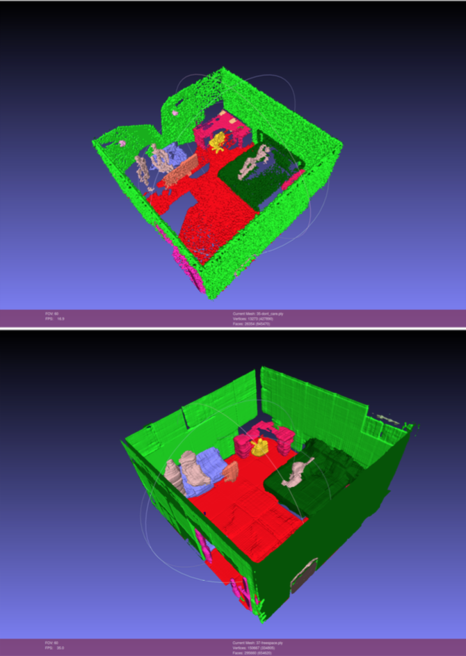

# Introduction

In a time where augmented and virtual reality applications are ever-increasing and where RGB-D cameras are everywhere, optimal 3D reconstruction of indoor environments gained importance and momentum.
State-of-the-art scanning techniques, though, do not allow satisfying scenes recreation and are always leading to the presence of holes in the reassembling. The latters often conduce to major issues when it comes to applications such as scene editing or 3D printing.The automatic completion of surfaces and semantics in 3D is a smart way to deceive this problem, but traditional methods such as Poisson Surface Reconstruction do not achieve satisfactory results. Due to the great success of deep learning in many areas of computer vision, neural networks seem to be a good path to follow.

It has been shown that modeling volumetric objects in an adversarial manner results in objects that are both novel and realistic: the same concept can be applied to scene completion, generating the missing parts.

we built a generative architecture combining features of different models. On top of a standard GAN architecture, we introduced a fully convolutional variational auto encoder that is able to learn a latent representation of a 3d volumetric grid with 38 classes per voxel and that gets smoothly pushed towards a 0-centered multivariate gaussian thanks to the introduction of an adversarial loss and an encoding discriminator. We perform a sampling strategy on the scenes so that at training time we process small blocks but at evaluation time we are able to tesselate the input and test on arbitrary size at a higher resolution than state-of-the-art methods ( 3cm3).
The completion achieved with the combination of the modern generative adversarial technology in a volumetric convolutional fashion and the power of variational auto encoders looks natural and highly varied.

# Data

[SUNCG](http://suncg.cs.princeton.edu/) dataset consists of a large scale database of 3D scenes. Every scene is semantically annotated at object level. We extracted from the SUNCG dataset 773 different rooms for training and 50 for testing, represented in 3D volumetric grids. The volumetric grid is a mesh of voxels (extracted at a resolution of 3cm3) with 38 entries per voxel (each per different class of object). 
As input, our method requires both partial 3D scan, encoded in a volumetric grid with truncated signed distance field values, and the 3D volumetric ground truth scene, encoded in a one hot fashion. In the latter case, every voxel has 38 entries representing the classes of the objects, where only one of those is set to 1 (if the voxels contains that class of object) while the others are set to 0.

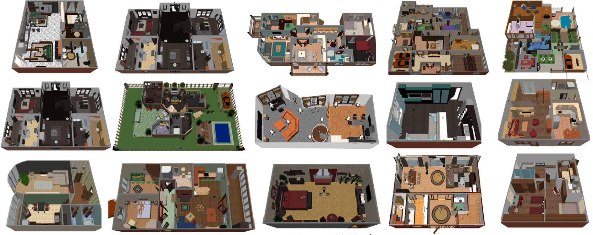

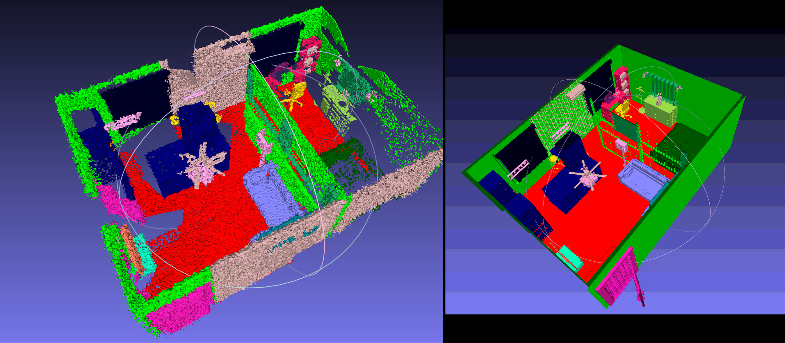

# Model

The figure below shows the architecture of our model, the 3D Variational Adversarial Auto Encoder Generative Adversarial Network.


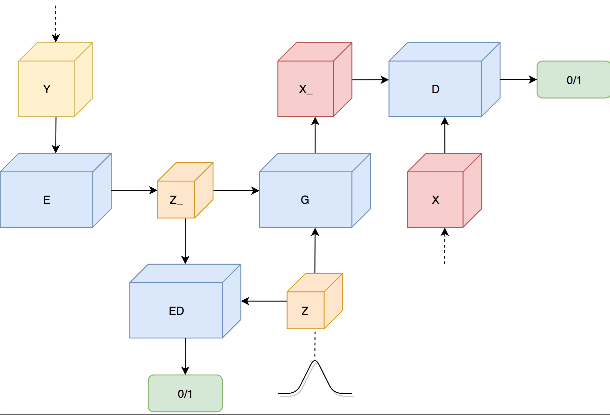


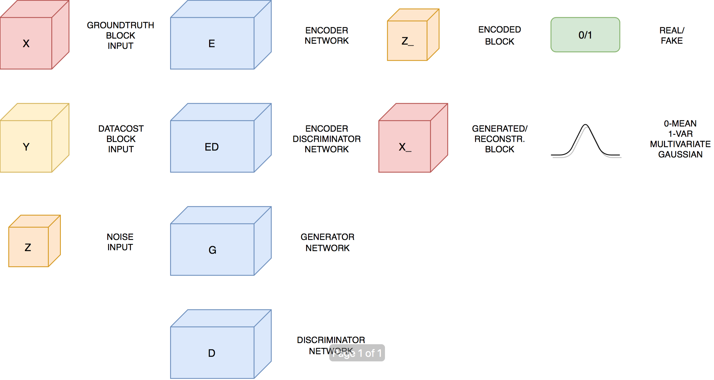


As said in the previous section, we combined the power of VAEs and GANs to get the best of both worlds : better learning of the latent representation, stability and more high-detailed results.
An encoder discriminator has been added to the architecture too. Adding this component to our model was inspired by Yu Nishimura’s work at Stanford as a visiting student with his project on multi-object GAN [3D-FCR-alphaGAN](https://github.com/yunishi3/3D-FCR-alphaGAN).
The encoder discriminator allows us to push the learned representation towards the prior dis- tribution with the help of an adversarial loss. During training it learns to distinguish between the learned distribution and the prior distribution, forcing the encoder to model the first one as similar as possible to the second one. This results in more stability

when learning and modeling the latent space, and better Semantic Accuracy when performing reconstruction (capturing small and less present objects).

# Processing

## Training Pipeline

In summary, the training process works as follows :

  - A room from the dataset is loaded, taking both the TSDF incomplete
    input as the groundtruth one.

  - A certain number (specified by the \(batchSize\) variable when
    launching the traning) of 32x32x32 blocks is sampled from the room.
    The same blocks are taken from both input and groundtruth.

  - The datacost blocks are encoded with the encoder.

  - A random input is sampled from the prior distribution.

  - Both the encoding of the blocks and the random input are fed to the
    encoder discriminator that tries to guess from which distribution
    they come from.

  - Both the encoding of the blocks and the random input are fed to the
    generator that, in the first case, tries to reconstruct the datacost
    blocks, and in the second case generates new 32x32x32x38 blocks.

  - Both the reconstructed blocks, the equivalent groundtruth blocks and
    the new generated blocks are fed to the discriminator that tries to
    guess whether they were generated by the generator or if they come
    from the dataset.

  - The various losses (explained in details in the following
    subsection) are computed.

  - The optimization is performed and the process is repeated. If a
    discriminator was able to guess correctly more than 80% of the
    blocks in the current iteration, it is not going to be optimized in
    the following one. This behavior helped stabilizing the training,
    preventing the discriminator loss to quickly sinks to zero.

## Loss Functions

The following screenshots define the losses of the model.

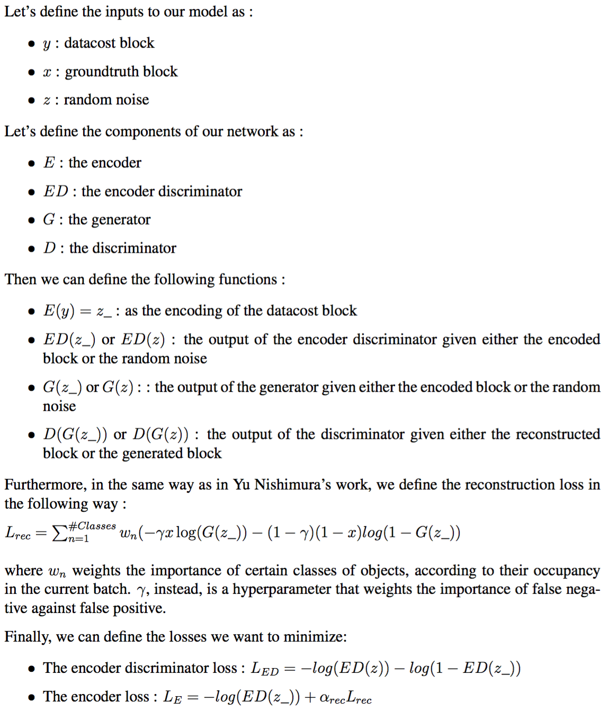

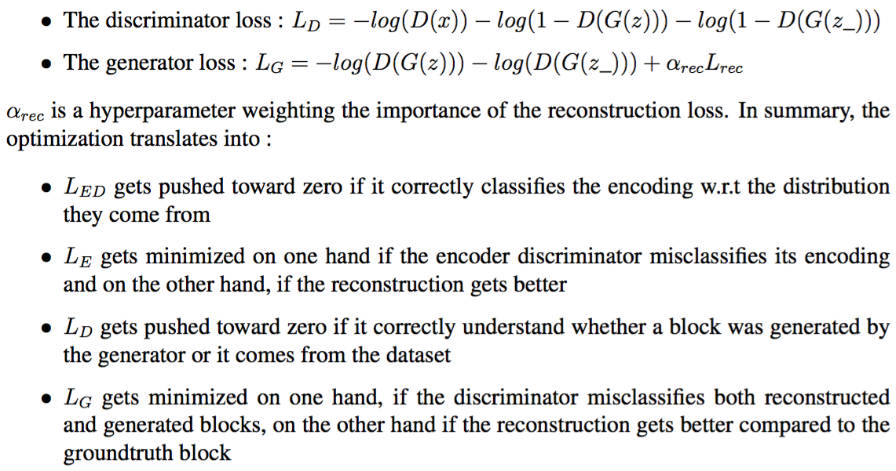
    
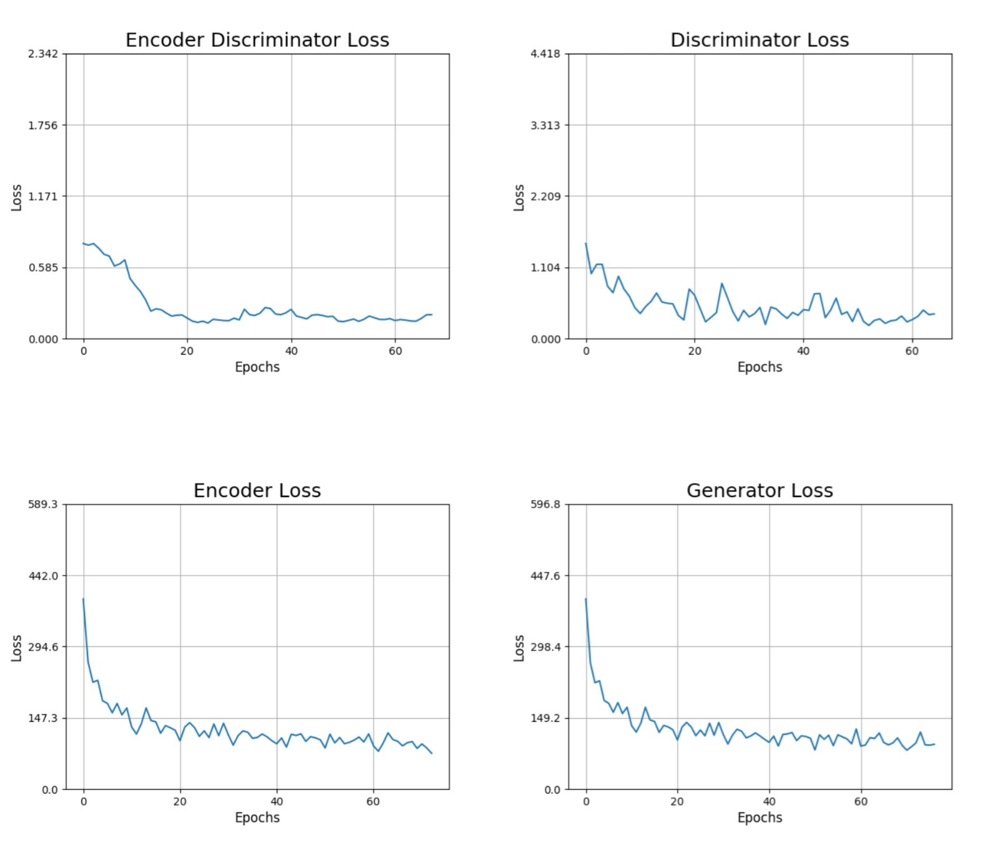
    
# Evaluation

We tested our model on 50 SUNCG
scenes. We evaluate the quality of the reconstruction
with different accuracy measures. The optimal model is the one that maximizes what we call the ***Semantic Accuracy***.

In order to choose the best model, the framework has been trained and
tested with different structures and configurations of parameters.

All the different structures that were evaluated ran with the following
settings :

  - \(epochs=80\)

  - \(batchSize=32\)

  - \(Adam Optimizer\) with \(learningRate=0.0001\) and \(beta1=0.5\)

  - \(alpha=0.2\) for the leaky ReLu activation function ()

  - \(\alpha_{rec}=1\) is the hyperparameter weighting the importance of
    the reconstruction loss
    
At test time different accuracy measures were computed :

  - An *Overall Accuracy*, where simply the mean number of correctly
    identified voxels between the reconstruction and the groundtruth is
    counted

  - A *Free Space Accuracy*, where the mean number of correctly
    identified free space voxels between the reconstruction and the
    groundtruth is counted

  - An *Occupied Accuracy*, where the mean number of correctly
    identified occupied voxels between the reconstruction and the
    groundtruth is counted

  - A ***Semantic Accuracy*** that corresponds to the mean number of
    correctly identified voxels among the occupied voxels between the
    reconstruction and the groundtruth room

The ***Semantic Accuracy*** is what matters the most since even if a
model achieves a lower *Overall Accuracy*, it is preferred to a model
that loses (or completely ignores) pieces of information about the small
or less present objects within the dataset (such as lamps).

The following table shows the comparison of
the ***Semantic Accuracy*** among all the previous stated models plus
the evaluated raw input data.

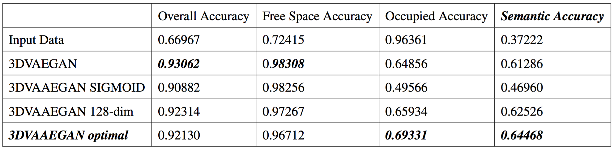

# Results

The following figures show examples of completions. One can see how the model smoothes everything and tries to complete the missing parts, such as the floor,
the bed or a table with chairs.

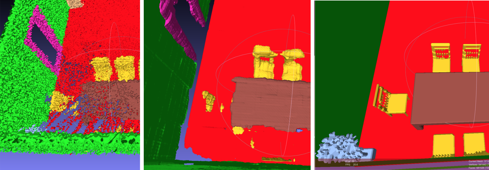

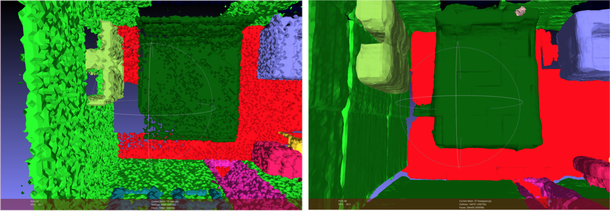

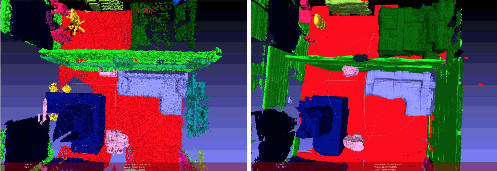



